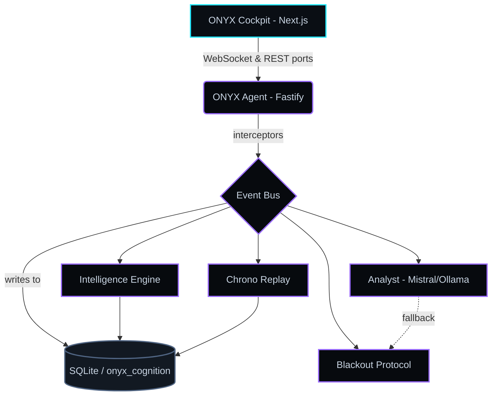
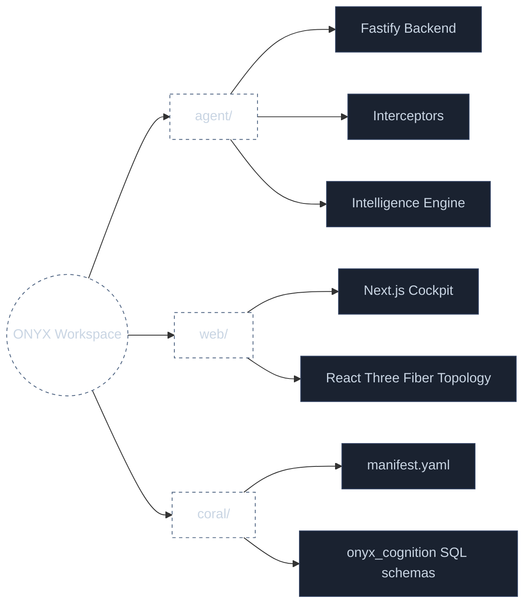

# ONYX

> **Autonomous Execution Intelligence Infrastructure**
> A local-first execution intelligence platform that transforms live software development into a relationally queryable operational graph.

ONYX is not a chatbot, dashboard, or AI wrapper. It is a cybernetic cockpit for the engineering process itself — a Bloomberg Terminal for software execution.

---

## What ONYX does

ONYX continuously intercepts your workspace at five layers, normalises every event into an append-only relational store, and reconstructs the **causal topology** of your engineering loop in real time.

| Layer | Source | Surfaced as |
|------|--------|--------------|
| **Filesystem** | `chokidar` save/edit/delete | `workspace_entropy` |
| **AST** | Tree-sitter structural deltas | `execution_snapshots` |
| **Terminal / Build** | exit codes, retry loops, compiler failures | `replay_events` |
| **System** | CPU / memory / thermal pressure | `system_cybernetics` |
| **Network** | localhost ports, outbound sockets, latency | `network_trajectories` |

Everything flows through the **ONYX Event Bus** into SQLite, where the **Relational Execution Engine** runs cross-source joins to surface failure cascades, friction, and instability *before* humans notice.

---

## Architecture



```text
┌──────────────────────── ONYX Cockpit (Next.js 15) ────────────────────────┐
│  3D Topology Graph · Telemetry Rails · Event Timeline · SQL Intel Feed    │
│  Replay Console · Build Stability · Blackout Indicator · Analyst Ticker   │
└───────────────────────────────────▲───────────────────────────────────────┘
                        WebSocket   │   REST  (port 4311)
┌───────────────────────────────────┴───────────────────────────────────────┐
│                       ONYX Agent (Fastify · TypeScript)                   │
│                                                                           │
│   Interceptors ─► Event Bus ─► SQLite (onyx_cognition schemas)           │
│        │              │                                                   │
│        │              ├─► Intelligence Engine (SQL joins)                 │
│        │              ├─► Chrono Replay (causal reconstruction)           │
│        │              └─► Analyst (Mistral │ Ollama fallback)            │
│        │                                                                  │
│        └─► Blackout Protocol (auto-route inference + cache continuity)   │
└───────────────────────────────────────────────────────────────────────────┘
```

### Coral Source: `onyx_cognition`
See `coral/manifest.yaml`. Six relational tables, JSONL ingestion contract, and DDL ready to register as a Coral custom source.

---

## Run

```bash
cp .env.example .env
npm install
npm run dev
```

This spawns:
- **Agent** at http://127.0.0.1:4311 (Fastify + WebSocket on `/stream`)
- **Cockpit** at http://127.0.0.1:3000

Open the cockpit and press **`D`** (or click *Demo*) to launch the cinematic 4-phase sequence:

1. **Healthy system** — baseline topology pulse
2. **Injected failure** — AST mutation → CPU spike → socket retries → compiler crash cascade
3. **Chrono replay** — causal reconstruction of the failure with scrubber
4. **Blackout protocol** — disconnect inference, fall back to local, preserve continuity

Press **`B`** at any time to toggle the blackout protocol manually.

### Native build prerequisites
`better-sqlite3` compiles a native binding on first install. On Windows, ensure Visual Studio Build Tools (or `npm i -g windows-build-tools`) are present; on macOS, Xcode CLT (`xcode-select --install`); on Linux, `build-essential`.

---

## Stack

**Frontend** Next.js 15 · TypeScript · Tailwind · shadcn/ui · Framer Motion · Zustand · Three.js · React Three Fiber
**Backend** Node 20 · Fastify · `ws` · `better-sqlite3` · `chokidar` · `tree-sitter` · `systeminformation`
**Intelligence** Coral MCP (`onyx_cognition` source) · Mistral `codestral-latest` · Ollama `open-codestral-7b`

---

## Layout



```text
agent/    Fastify backend, interceptors, intelligence engine, chrono replay
web/      Next.js cockpit
coral/    onyx_cognition source spec (manifest, schemas, fixtures)
```
